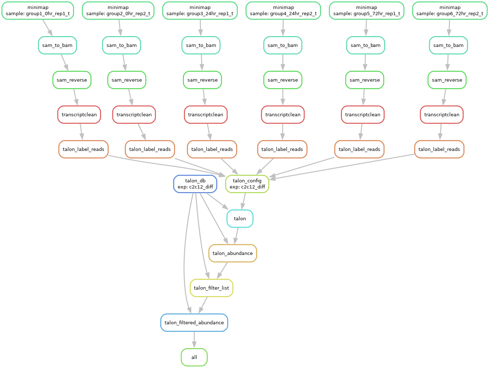

# COSMOS 2023 - Long-read analysis of C2C12 Differentiation.

# Instructions
1. Clone this repository in your folder on the UCI HPC
`git clone https://github.com/jazsakr/cosmos2023_c2c12_smk.git`
2. Run the set-up script and follow the on-screen instructions
`bash set-up.sh`
3. Run the script that runs snakemake file
`bash run_smk.sh`

---

# Description

## Samples
C2C12 myoblasts were differentiated into myotubes and made into long-read Nanopore libraries.

## Preprocessing
The following is provided for you:
- Basecalled and trimmed reads
- Mouse reference genome and annotation

## Long-read Pipeline:
This workflow uses [snakemake](https://snakemake.readthedocs.io/en/stable/) to run the long-read pipline using [TranscriptClean](https://github.com/mortazavilab/TranscriptClean) and [TALON](https://github.com/mortazavilab/TALON).

### Step 1: initial setup
Running the `set-up.sh` script does the following:
	- install package manager `conda` and `mamba`
	- configure `conda` by adding channels
	- clone long-read packages `TranscriptClean` and `TALON`
	- create environment with `snakemake` and `TALON` installed
### Step 2: run snakemake
Runing the `run_smk.sh` script does the following:
	- Map to genome using `minimap2`
	- Reverse flipped reads with custom script
	- Reference-based error correction using `TranscriptClean`
	- Quantify and categorize transcripts using `TALON`

Snakemake workflow:

